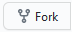

# Kontaktliste

> ## Norsk Digital Kultur

**\<NB\>** _Ikke en faktisk liste over medlemsforeninger enda_ **\<\/NB\>**

**\<NB\>** _Foreløpig brukt som en åpen kontaktliste_ **\<\/NB\>**

<table>
  <tr>
    <th>Organisasjon</th>
    <th>Nettsted</th>
    <th>E-postadresse</th>
    <th>Sosiale Medier</th>
  </tr>

  <tr>
    <td><h3>Casual Gaming</h3></td>
    <td>
      <ul>
        <li><a href="https://casualgaming.no" target="_blank">casualgaming.no</a></li>
        <li><a href="https://trondelan.no" target="_blank">trondelan.no</a></li>
        <li><a href="https://studlan.no" target="_blank">studlan.no</a></li>
      </ul>
    </td>
    <td>post📧casualgaming.no</td>
    <td>
      
      
      
      
    </td>
  </tr>

  <tr>
    <td><h3>Errors Party<h3></td>
    <td>
      <ul>
        <li><a href="https://errorsparty.no" target="_blank">errorsparty.no</a></li>
      </ul>
    </td>
    <td>styret📧errorsparty.no</td>
    <td>
      
      
    </td>
  </tr>

  <tr>
    <td><h3>HordaLAN Dataforening<h3></td>
    <td>
      <ul>
        <li><a href="https://hordalan.no" target="_blank">hordalan.no</a></li>
      </ul>
    </td>
    <td>info📧hordalan.no</td>
    <td>
      
      
      
      
      
      
    </td>
  </tr>

  <tr>
    <td><h3>KANDU<h3></td>
    <td>
      <ul>
        <li><a href="https://www.kandu.no" target="_blank">kandu.no</a></li>
        <li><a href="https://www.gathering.org/" target="_blank">gathering.org</a></li>
      </ul>
    </td>
    <td>kontoret📧kandu.no</td>
    <td>
      
      
    </td>
  </tr>

  <tr>
    <td><h3>Vestfold Digitale Ungdom<h3></td>
    <td>
      <ul>
        <li><a href="https://www.digitalungdom.no" target="_blank">digitalungdom.no</a></li>
        <li><a href="https://www.globelan.no" target="_blank">globelan.no</a></li>
      </ul>
    </td>
    <td>styret📧digitalungdom.no</td>
    <td>
      
      
      
      
    </td>
  </tr>

</table>

<!--
  <tr>
    <td><h3>ORGANISASJON<h3></td>
    <td>
      <ul>
        <li><a href="URL" target="_blank">NETTSIDE</a></li>
      </ul>
    </td>
    <td>EMAIL📧DOMENE</td>
    <td>
      
      
      
      
      
      
      
    </td>
  </tr>
-->

---

## Ønsker du å legge til din organisasjon i listen over?

Opprett en [sak](https://github.com/digitalkultur/kontaktliste/issues/new) og legg ved tilsvarende informasjon som du finner i tabellen over.

Eventuelt kan man også legge inn et endringsforslag (`pull request`) via -knappen ved å laste opp endringene utført til GitHub, og deretter bruke web-grensesnittet til å sende inn et endringsforslag opp mot `digitalkultur/kontaktliste`.
